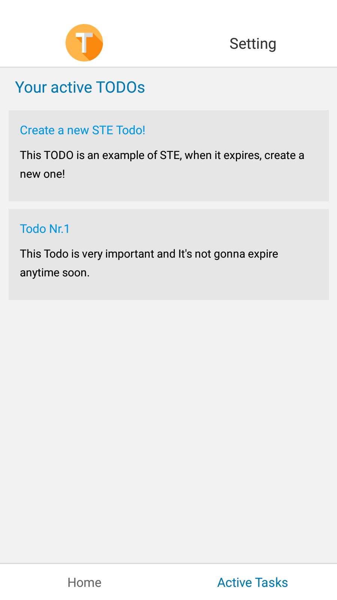

# Demo pictures, taken from Expo-go on Android

## Home

## Create new TODO

## Create new TODO - using date picker

## Setting screen

## Managing a valid todo

## Managing an expired todo

## Active todo's screen

